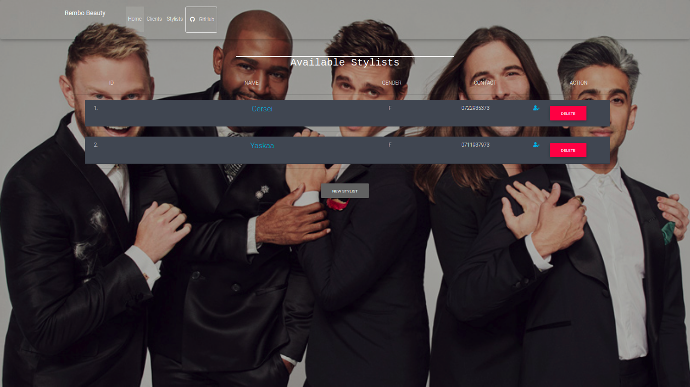

# Hair Salon
#### Hair Salon, April 24th 2019
#### By **Peter Wachira**


## Author's name
Peter Wachira
## Description

```bash
Its an app that allows the owner to add a list of the stylists, and for each stylist, add clients who see that stylist.
The stylists work independently, so each client only belongs to a single stylist.
```

## User Requirements
```bash
The applications allow users to do the following:
1.Add a new stylist
2.Assign a new client to a stylist
4.View a list of current stylists
3.View a list of clients assigned to a stylist

```

## Contact Details
```bash
You can contact me at pwachira900@gmail.com
```

## License

- This project is licensed under the MIT Open Source license Copyright (c) 2019. [Peter Wachira](https://github.com/peter-wachira/Hair-Salon/blob/master/LICENCE)
[](https://forthebadge.com)
[](https://forthebadge.com)
[](https://forthebadge.com)
[](https://forthebadge.com)